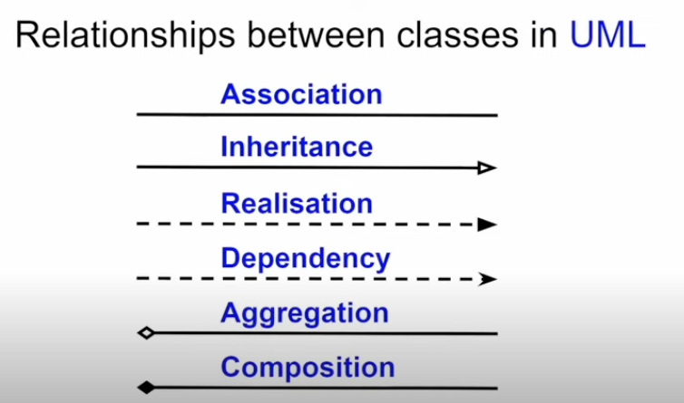

# Basic Syntax for Class Diagrams in UML

Class diagrams are a fundamental tool in UML (Unified Modeling Language) for visualizing the structure of a system by representing classes, their attributes, operations, and relationships. Here's a summary of the basic syntax

## Classes

* Represented by rectancles with three components
  * **Name:** The top compartment contains the class name in bold.
  * **Attributes:** The middle compartment lists the class's attributes (data member) with visibility symbols
    * `+` for public
    * `-` for private
    * `#` for protected
  * **Operations:** The bottom compartment lists the class's operations (methods) with visibility symbols and parameters.
* Example:
  
| ClassName |
| --- |
| + attribute1 |
| - attribute2 |
| # attribute3 |
| + operation1() |
| - operation2(p1) |
| # operation3() |

## Relationships

* **Assocation:** A general relationship between classes, often indicating that one class knows about or uses another. Represented by a solid line with optional arrowheads and labels.
  * **Multiplicity:**  Indicates how many instances of one class are related to instances of another class (e.g., `1`, `*`, `0..1`).
* **Generalization (Inheritance):** A relationship where one class (subclass) inherits properties and behavior from another class (superclass). Represented by a solid line with a hollow arrowhead pointing to the superclass.
* **Dependency:** A relationship where one class depends on another class, but not necessarily through direct usage. Represented by a dashed line with an arrowhead pointing to the class being depended on.
* **Realization:** A relationship where one class implements an interface defined by another class. Represented by a dashed line with a hollow arrowhead pointing to the interface.

## Additional Elements

* **Interfaces:** Similar to classes but represent contracts for behavior without implementation. Represented by a circle with the interface name.
* **Abstract Classes:** Classes that cannot be instantiated directly. Their names are italicized in the class diagram.
* **Notes:** Can be added to provide additional information or clarify relationships. Represented by a rectangle with a folded corner.

## Things to Improve

* It's important to specify parameters for functions
* It's importnat to specify what one class depends on from the other class
* It's importnat to specify the public/private status of the function or variable
* Document every function even if its just the brief.
* All variables must come from a struct/class and not just be loose and random unless they are local variables. This is specailly true for parameters to functions 
