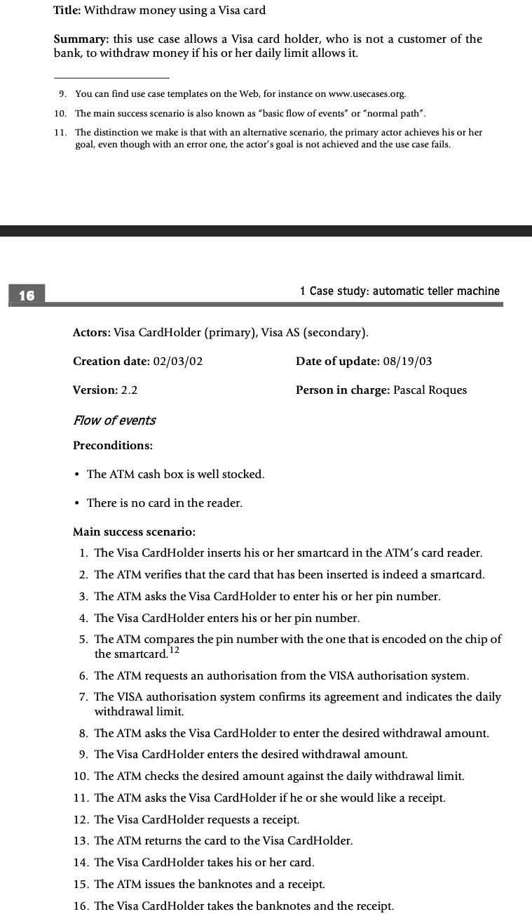

# Software Architecture

The Clean Architecture diagram represents a way of structuring software applications to achieve separation of concerns, maintainability, and testability. It consists of concentric layers, each with specific responsibilities:

1. **Entities (Innermost Layer):**
   * Represent the core business objects and their relationships.
   * Contain business logic and rules that are independent of any specific technology or framework.
   * Should be the most stable and least affected by changes in outer layers.
2. **Use Cases:**
   * Represent the interactions and behaviors within the system.
   * Orchestrate the flow of data between entities and other layers.
   * Implement business rules and application logic.
3. **Interface Adapters:**
   * Convert data and requests between the inner layers (Entities and Use Cases) and the outer layers (Frameworks & Drivers).
   * Act as a bridge, allowing the inner layers to remain independent of specific technologies used in the outer layers.
4. **Frameworks & Drivers (Outermost Layer):**
   * Include technologies, frameworks, and tools used by the application, such as databases, web frameworks, UI libraries, etc.
   * Are considered "details" and should not affect the core business logic in the inner layers.
  
## The Dependency Rule

The key principle of Clean Architecture is the **Dependency Rule: Inner layers should not depend on outer layers, but outer layers can depend on abstractions of inner layers.** This means that changes in the outer layers (e.g., switching to a different database) should not affect the core business logic in the inner layers.

* Remember, class diagrams represent the relationships between classes, not the internal logic of how they interact. So, focus on the direct dependencies between objects when drawing the arrows.
* if Object A depends on Object B to access Object C the arrow would be drawn from Object A to Object B

## Flow of Control

The diagram also shows the typical flow of control in a Clean Architecture application:

1. A request comes in from the UI or an external device.
2. The Controller (part of the Frameworks & Drivers layer) receives the request and interacts with the Use Case layer.
3. The Use Case layer orchestrates the business logic, potentially interacting with Entities and Interface Adapters.
4. The result is sent back through the Interface Adapters and eventually to the UI or external device.

## **Examples for Different Layers**

## Entities

* `User` class with attributes like `name`, `email`, and methods like `changePassword`.
* `Product` class with attributes like `name`, `price`, and methods like `calculateDiscount`.

## Use Cases

* `RegisterUser` use case that interacts with the `User` entity to create a new user.
* `PlaceOrder` use case that interacts with `Product` and `Order` entities to process an order.

## Interface Adapters

* A repository class that translates between the `User` entity and the database (e.g., converting a `User` object to a database record).
* A controller class that receives web requests and interacts with Use Cases to fulfill them.

## Frameworks & Drivers

* A specific database system (e.g., MySQL, PostgreSQL).
* A web framework (e.g., Spring MVC, Django).
* A UI library (e.g., React, Angular).

## Example of an Use Case in Text

