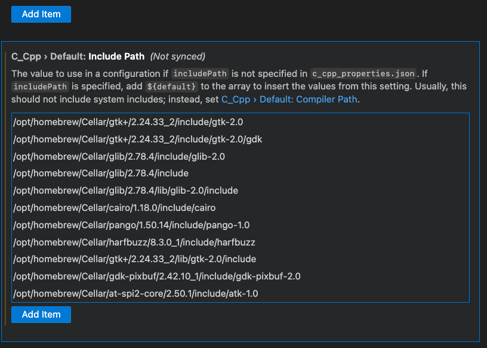

# VScode Solutions

## Fixes

### GTK Include Lint Error

Make sure to include the necessary libraries on VSCode to load GTK and fix syntax errors.

The libraries are installed when running the command:
`brew install gtk+` on the the folder at `opt/homebrew/Cellar/`

